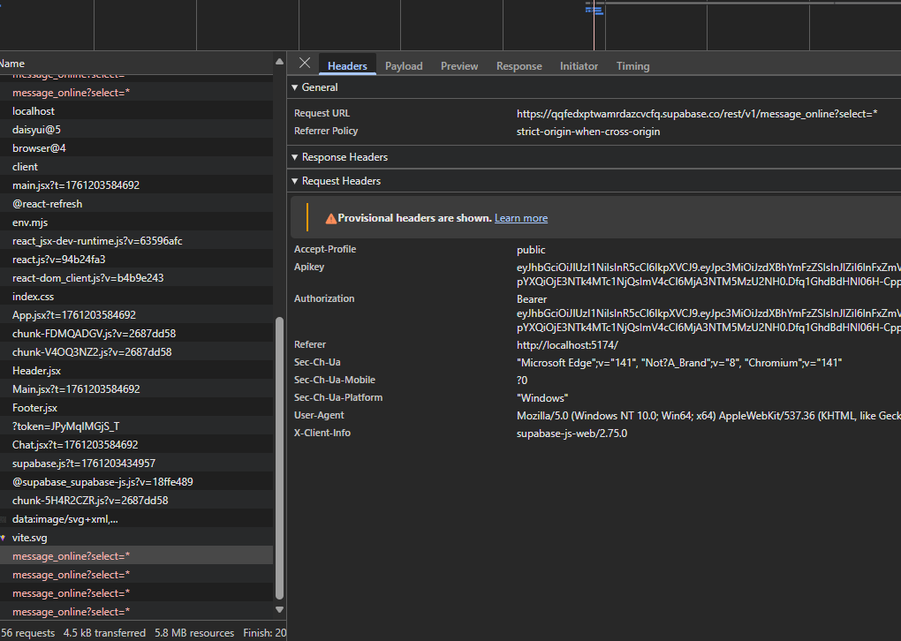
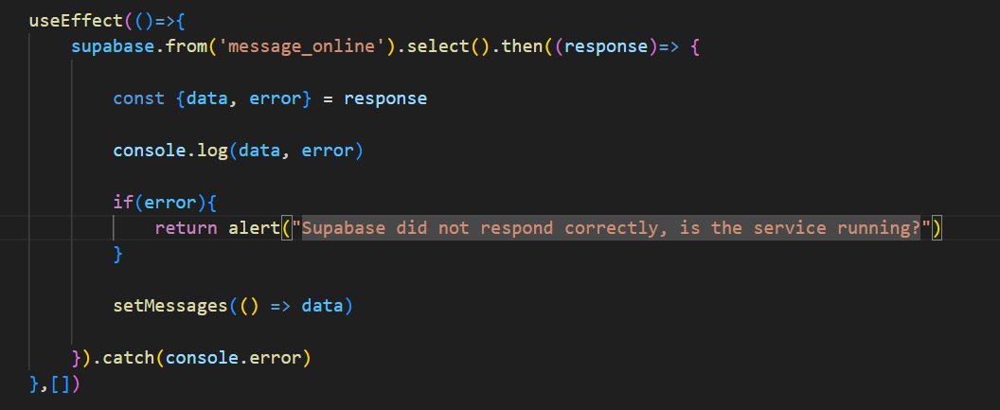
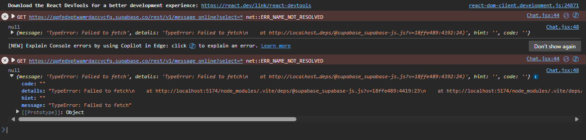
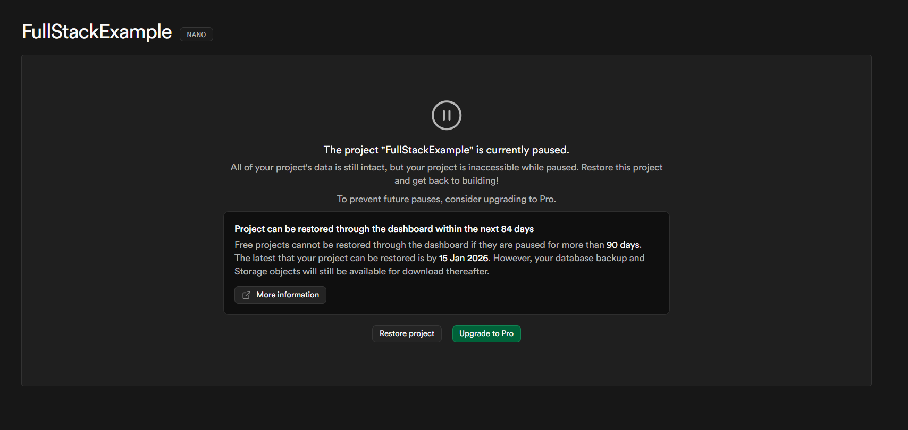

# List of possible issues that can happen durign taskseries 2

## Node & npm

Most frequently appearing issue is the package management:
1. Forgetting to install dependencies after clone with `npm install`
  - Easy to spot: `node_modules`-folder is missing from the project
2. Changing branch locally might require re-installing the dependencies
3. Not updating the packages, again with `npm install`, after pulling latest changes from upstream repository

## Supabase

Supabase free-tier instance closes after certain period of inactivity and needs to be revived.

### Issue

- Issue is that during the development **everything just seems to have been broken with no obvious reason.**

Without proper error handling the **screen might be blank white. **

Examining the error in network debugging we notice that we never get a response from the supabase's API, thus that is the likely culpcript for the error. 

In case of the environment variables (supabase key or project's API-url) are missing or wrong, supabase-js -client should still show us the error as value.

_Very likely reason is also that both issues are present at the same time, the `.env` missing and the supabase-service is at sleep._

When logging the error and data to console we can see that we are actually receiving error in both cases:

_console log with both, data and error_

_console with the logged values: data = null and error = {...}_

Solution: 
- Robust error handling and identify when the issue is exactly the reason that the service is at temporary sleep
- Go to supabase panel and restore service
  - _Important to give whole team shared access to supabase project!_

